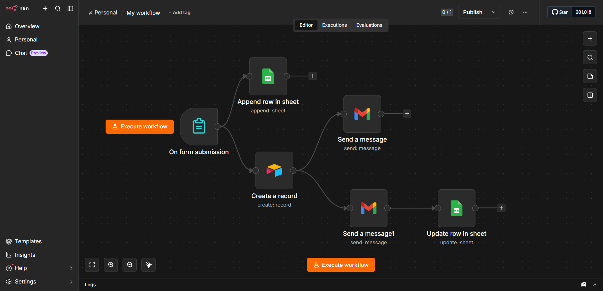
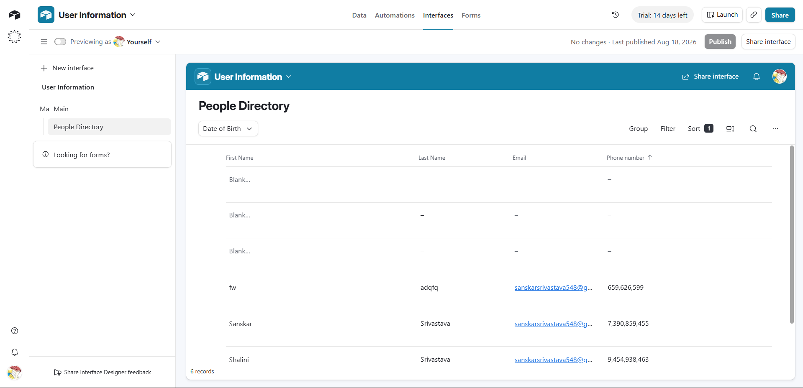

# 🚀 User Registration Automation — n8n Workflow

> Turn a simple form submission into a fully automated registration pipeline — no manual data entry, no follow-up emails to write by hand.


---

## ✨ What This Does

Someone fills out a registration form → this workflow takes over from there:

```
📝 Form Submission
        │
        ├──────────────┬──────────────
        ▼                              ▼
📊 Google Sheets                 🗂️  Airtable
  (append row)                  (create record)
                                      │
                                      ├──────────────┬──────────────
                                      ▼                              ▼
                              📧 Email #1                    📧 Email #2
                            (notify admin)               (welcome the user)
                                                                  │
                                                                  ▼
                                                        📊 Google Sheets
                                                        (mark row as sent)
```

No code, no manual copy-pasting between tools — just fill the form and everything else happens on its own.

---

## 🔧 Workflow Breakdown

| Step | Node | What it does |
|------|------|---------------|
| 1️⃣ | **On form submission** | Captures First Name, Last Name, Phone Number, Date of Birth, and Email |
| 2️⃣ | **Append row in sheet** | Logs the raw submission into a Google Sheet |
| 2️⃣ | **Create a record** | Simultaneously logs the same data into an Airtable base |
| 3️⃣ | **Send a message** | Sends an internal notification email |
| 3️⃣ | **Send a message1** | Sends a welcome/confirmation email to the registrant |
| 4️⃣ | **Update row in sheet** | Marks the Google Sheet row as processed once emails go out |

---

## 🖼️ Preview

### Workflow Canvas
The full automation as it looks inside n8n:



### Data Landing in Airtable
Every submission flows straight into a clean, filterable Airtable directory:



---

## 🧰 Requirements

- An n8n instance (cloud or self-hosted)
- Configured credentials in n8n for:
  - 🔑 Google Sheets OAuth2
  - 🔑 Airtable Personal Access Token
  - 🔑 Gmail OAuth2

---

## ⚙️ Setup

1. **Import** `My_workflow.json` into n8n → `Workflows → Import from File`
2. **Reconnect credentials** — link each node (Google Sheets, Airtable, Gmail) to your own accounts
3. **Swap the placeholders** for your real values:

   | Placeholder | Replace with |
   |---|---|
   | `YOUR_GOOGLE_SHEET_ID` | Your Google Sheet's document ID |
   | `YOUR_AIRTABLE_BASE_ID` | Your Airtable base ID |
   | `YOUR_AIRTABLE_TABLE_ID` | Your Airtable table ID |
   | `your-email@example.com` | The email address that should receive notifications |

4. **Activate** the workflow and grab the form trigger's webhook URL to start collecting submissions 🎉

---

## 📌 Notes

- 🔒 Credentials (OAuth tokens/API keys) are **never** included in n8n's exported JSON — you'll need to set those up fresh.
- 🧩 Node versions used: `formTrigger` v2.6 · `googleSheets` v4.7 · `airtable` v2.2 · `gmail` v2.2

---

<p align="center">Built with ❤️ using n8n</p>
